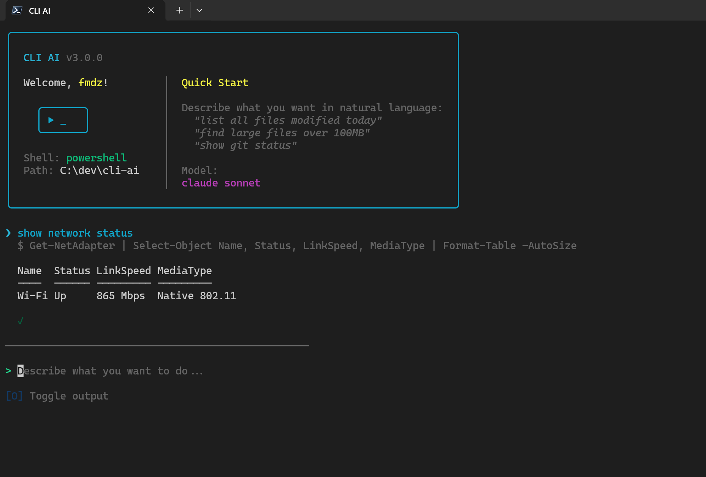

# CLI AI

[](https://www.npmjs.com/package/@fmdzc/cli-ai)
[](https://opensource.org/licenses/ISC)
[](https://nodejs.org/)

**Agentic AI assistant for your terminal.** Give it a task in plain language and it reasons, plans and executes across files, commands and code autonomously.

Built for engineers who live in the terminal. CLI AI brings agentic tool-use to DevOps workflows, system administration and everyday shell operations.

Supports **Anthropic**, **OpenAI** and **OpenRouter** providers.



## Why CLI AI

Traditional shell helpers translate a prompt into a single command. CLI AI goes further. It runs a full agentic loop: it reads your files, searches your codebase, writes edits, executes commands and chains multi-step reasoning until the task is done. You stay in control with a built-in permission system that gates every tool call.

## Features

- **Agentic tool-use** - Multi-turn reasoning with 7 built-in tools (bash, file read/write/edit, glob, grep and directory listing)
- **Permission system** - Allow, ask or deny gates per tool with approve-for-session support
- **Streaming markdown** - Real-time rendered responses with headings, code blocks, lists and links in the terminal
- **Multi-provider** - Anthropic, OpenAI and OpenRouter with any model ID
- **Shell-aware** - Detects your shell and tailors commands to match (bash, zsh, fish, PowerShell, cmd)
- **Cross-platform** - Windows, macOS and Linux
- **Secure key storage** - API keys stored in your system keyring, never in plain text
- **Context compaction** - Automatic conversation summarization when context grows large

## Quick Start

```bash
# Install globally
npm install -g @fmdzc/cli-ai

# Launch
s
# or
cli-ai
```

On first run you will be prompted for an API key. Get one from:
- [Anthropic](https://console.anthropic.com/settings/keys)
- [OpenAI](https://platform.openai.com/api-keys)
- [OpenRouter](https://openrouter.ai/keys)

## How It Works

```
You: "find all TODO comments in src/ and write a summary to TODO.md"

CLI AI:
  1. grep_search  → scans src/ for TODO patterns
  2. file_read    → reads matching files for context
  3. file_write   → creates TODO.md with a structured summary
  4. Done.
```

The agent plans and executes each step. You approve tool calls as they happen or pre-approve tools you trust.

## Built-in Tools

| Tool             | Description                          |
| ---------------- | ------------------------------------ |
| `bash_execute`   | Run shell commands                   |
| `file_read`      | Read file contents                   |
| `file_write`     | Create or overwrite files            |
| `file_edit`      | Apply targeted edits to files        |
| `glob_search`    | Find files by pattern                |
| `grep_search`    | Search file contents with regex      |
| `list_directory` | List directory contents              |

## Slash Commands

| Command   | Description             |
| --------- | ----------------------- |
| `/config` | Open settings panel     |
| `/help`   | Show help and shortcuts |
| `/clear`  | Clear conversation      |
| `/exit`   | Exit application        |

## Keyboard Shortcuts

**Input Mode**
| Key      | Action               |
| -------- | -------------------- |
| `Enter`  | Submit query         |
| `/`      | Open command palette |
| `Ctrl+D` | Exit (when empty)    |

**Settings Panel**
| Key         | Action         |
| ----------- | -------------- |
| `Tab`       | Next section   |
| `Up/Down`   | Navigate items |
| `Enter`     | Toggle/Select  |
| `1-9`       | Jump to tab    |
| `Esc`       | Close          |

## Settings

Access settings with `/config`:

### Provider and Model

- **Anthropic** - Claude models
- **OpenAI** - GPT models
- **OpenRouter** - 100+ models from various providers

Use the built-in presets or enter a custom model ID.

### API Keys

Manage API keys per provider. Keys are stored in your system keyring with an encrypted file fallback when the keyring is unavailable.

| Platform | Keyring Backend                             |
| -------- | ------------------------------------------- |
| macOS    | Keychain                                    |
| Windows  | Credential Manager                          |
| Linux    | Secret Service API (GNOME Keyring, KWallet) |

## Requirements

- **Node.js 20+**
- **Build tools** for native modules:

| Platform      | Command                                            |
| ------------- | -------------------------------------------------- |
| Windows       | `npm install -g windows-build-tools` (Admin)       |
| macOS         | `xcode-select --install`                           |
| Ubuntu/Debian | `sudo apt install build-essential libsecret-1-dev` |
| Fedora        | `sudo dnf install gcc-c++ libsecret-devel`         |
| Arch          | `sudo pacman -S base-devel libsecret`              |

## Development

```bash
git clone https://github.com/fmdz387/cli-ai.git
cd cli-ai
pnpm install
pnpm dev        # Watch mode
pnpm build      # Production build
```

## License

ISC
